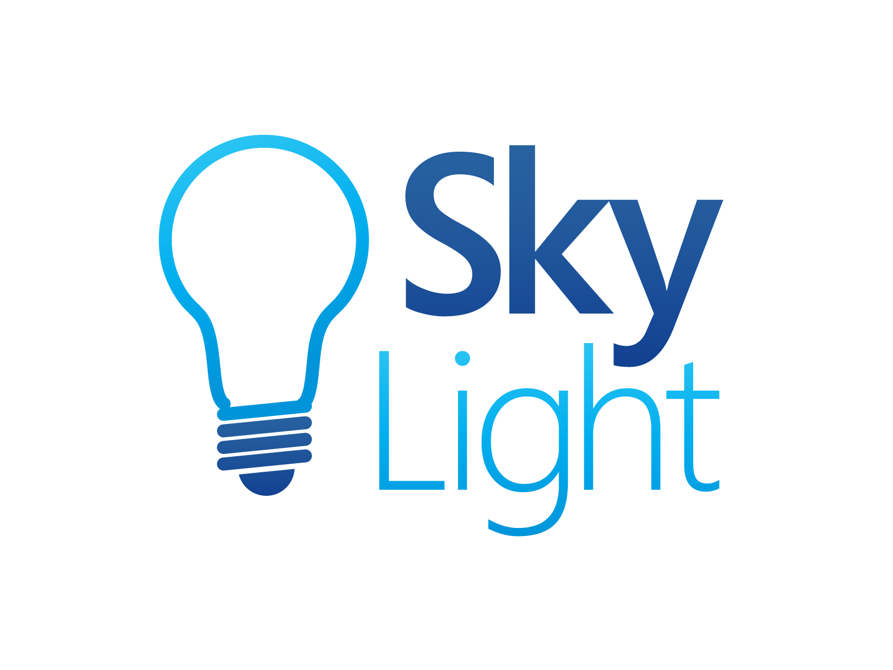

# Ansible Windows Workshop

These ansible playbooks provision a lab on AWS for use in delivering a workshop focused on Windows.  This provisions the following:

* Base Infrastructure
  * A Microsoft Active Directory Server (and AD domain)
  * A Gitlab server
* Per-Student Infrastructure
  * An Ansible/Tower control node
  * A Windows Workstation for interacting with the environment
  * A Windows Hosts for running playbooks against

The client pre-requisite to use this workshop is simply to have an RDP client which can connect to the Windows Workstation.  All other activities will take place from that jump point.  The workstation has Visual Studio Code, Chrome, Putty, and Git for Windows.  

## Usage

This workshop requires Ansible 2.6 and pywinrm.

In addition to this, for AWS you will need Boto 1.7 for communicating.  

Then I have something like this: 
~/.aws/config
[default]
region = us-east-1
output = table

~/.aws/credentials
[default]
aws_access_key_id = <your ec2 access key>
aws_secret_access_key = <your ec2 secret key>


Beyond that, the main thing that needs to be edited is the *vars/main.yml* file which contains the configuration details specific to your environment.  You can instead copy this file to *vars/custom.yml* and it will use that instead of the main.yml file.  It will check for the custom.yml file first, and use main.yml if its not found.  This ensure your settings are not overridden if you update git, and are not committed to git (this file is ignored).

For each workshop it is recommended that you utlilize the custom.yml to maintain the majority of the nonchanging settings, and then you can create a separate vars file (to be included in via extravars) with just the variables you need for the individual workshop.

```
## Example extra vars file 
instance_loc: aws
name_prefix: "skylight"
user_count: 1
towerversion: 3.2.7
```


The main configurations to change are as follows:

DNS is available only in this environment.  The default is safe.  Set a domain admin password (that meets AD requirements).


```
# Needed for AD and windows client provision
dns_domain_name: "ansibleworkshop.com"
domain_admin_password: "MyP@ssw0rd21"
```

Enter your pre-existing AWS keypair, private key file, and VPC details.  Note the VPC must be public facing with an internet (or nat) gateway for proper communication.  
```
# Overrides for manage-ec2-instances role
keypair: "aws_keypair"
vpc_id: "vpc-########"
vpc_subnet_id: "subnet-########"
region: "us-east-1"
ec2_key_file: "/home/<user>/.ssh/myprivatekey.pem"
```

Next we need to create user details.  First is the password set for all users.  This too needs to meet AD restrictions.  Note that a standard AWS account is limited to 20 ec2 instances, so update your quota in advance.  Also note that each student gets 3 machines.  Make certain your VPC is large enough.  

```
# Number of users and prefix for user name
users_password: "AnsibleWorkshop21#"
# Number of user labs to deploy
user_count: 2
# Prefix for each user name (ie student1, student2, etc)
user_prefix: student
```

Next fill in your VPC cidr and the equivalent reverse DNS lookup.  Yes, this could be done programatically in ansible... But it's not!
```
# Needed for reverse lookup DNS setup
ptr_zone_name: "1.168.192.in-addr.arpa"
ptr_zone_cidr: "192.168.1.0/24"
```

Now fill in details of your AD domain for integrating the Tower host.  This is kerberos level integration.  Tower itself is not integrated to AD.  
```
# Tower LDAP Integration
ldap_search_base: "DC=ansibleworkshop,DC=com"
ldap_access_filter: "(&(objectClass=user)(memberOf=CN=Ansible Users,CN=Users,DC=ansibleworkshop,DC=com))"
```

For gitlab install and LDAP integration there are several variables.  The main ones that should interest you are making certain the `gitlab_ldap_bind_dn` and `gitlab_ldap_base`$.
```
# Gitlab variables
gitlab_external_url: "https://gitlab.{{ dns_domain_name }}/"
gitlab_git_data_dir: "/var/opt/gitlab/git-data"
gitlab_backup_path: "/var/opt/gitlab/backups"
gitlab_edition: "gitlab-ce"
   # SSL Config
gitlab_redirect_http_to_https: "true"
gitlab_ssl_certificate: "/etc/gitlab/ssl/gitlab.crt"
gitlab_ssl_certificate_key: "/etc/gitlab/ssl/gitlab.key"
   # SSL Self-signed Certificate Configuration.
gitlab_create_self_signed_cert: "true"
gitlab_self_signed_cert_subj: "/C=US/ST=North Carolina/L=Raleigh/O=Ansible/CN=gitlab"

   # LDAP Configuration.
gitlab_ldap_enabled: "true"
gitlab_ldap_host: "windc.{{ dns_domain_name }}"
gitlab_ldap_port: "389"
gitlab_ldap_uid: "sAMAccountName"
gitlab_ldap_method: "plain"
gitlab_ldap_bind_dn: "CN=Admin,CN=Users,DC=ansibleworkshop,DC=com"
gitlab_ldap_password: "{{ domain_admin_password }}"
gitlab_ldap_base: "DC=ansibleworkshop,DC=com"

   # General Config
gitlab_time_zone: "UTC"
gitlab_backup_keep_time: "604800"
gitlab_download_validate_certs: yes

   # Email configuration.
gitlab_email_enabled: "false"
gitlab_smtp_enable: "false"
```

That's it.  Easy, right ?!?   Now run it (it just executes on localhost):

```
ansible-playbook provision.yml
```

It takes roughly 1 hour to provision an environment for a single student.  For multi student accounts, it is recommended you set the number of forks to the number of students.  The main reason is so the Tower installations to run all in parallel.

All inventories will be placed in a folder named "workshops" in your local directory executing the playbook.  There are student#-instances.txt for each student there.  Also, there is an instructor-inventory.txt.  The student inventory is also placed on their tower host as /etc/ansible/hosts

## Connecting to the environment

The workshop has people connect through RDP to the workstation for their lab and then interact with other systems from there.  However, all systems are accessible publicly at the moment, so there is nothing stopping you from connecting directly.  Look in the student#-instances.txt and instructor_inventory.txt files for ip addresses, users, and passwords.

